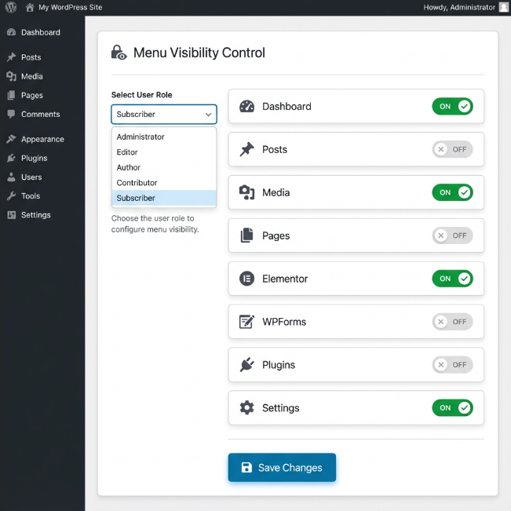

# User Menu Control 🛡️

**User Menu Control** is a lightweight, dynamic WordPress plugin designed to give Administrators complete control over what **Subscribers** and **Editors** see in the WordPress Admin Dashboard.

By default, WordPress allows certain roles to see specific menus. This plugin flips that logic: **it hides everything** (except Dashboard & Profile) by default, and lets you **selectively allow** specific menus for specific users.

It solves the common problem of clients getting confused by too many options or "Admin-only" plugins (like Elementor, WPForms) not being visible to lower-level users even when you want them to be.

## 🚀 Features

- **Dynamic Menu Detection:** Automatically detects _all_ installed plugin menus (WooCommerce, Elementor, WPForms, Custom Post Types, etc.) without any hardcoded logic.
- **Whitelisting System:** Simply tick the checkboxes for the menus you want a specific user to see.
- **Smart Capability Handling:** Automatically grants the necessary permissions (capabilities) to the user for the specific allowed menus.
  - _Example:_ If you allow "Elementor" for a Subscriber, the plugin safely grants them access to view that specific page, even if it normally requires Admin rights.
- **Clean Dashboard:** Non-admin users see a clean interface with only "Dashboard", "Profile", and your allowed items.
- **Login Redirect:** (Optional) Set a custom URL to redirect specific users to immediately after they log in.
- **Admin Bar Cleanup:** Removes unnecessary nodes from the top Admin Bar for a cleaner experience.

## 📸 Screenshots

### Modern User Interface

The plugin features a clean, modern interface with:

- **Cascading Dropdowns:** Select role first, then choose specific user
- **Toggle Switches:** Easy ON/OFF controls for each menu item
- **Card-Based Layout:** Clean, organized display of user settings
- **Responsive Grid:** Menu items displayed in a professional grid layout

## 🛠️ Installation

1.  Download the plugin folder/zip.
2.  Upload it to your WordPress site via **Plugins > Add New > Upload Plugin**.
3.  **Activate** the plugin.

## ⚙️ How to Use

1.  Go to your WordPress Dashboard as an Administrator.
2.  Navigate to the newly added **User Menu Control** menu item (usually near the bottom).
3.  You will see a list of all users with **Subscriber** or **Editor** roles.
4.  **To Allow Menus:**
    - Find the user you want to manage.
    - Check the boxes for the menus you want them to access (e.g., _Posts_, _Pages_, _Elementor_).
5.  **To Set Redirect (Optional):**
    - Enter a full URL (e.g., `https://yoursite.com/wp-admin/edit.php`) in the "Login Redirect URL" field.
6.  Click **Save Changes**.

Now log in as that user to test! They will only see what you have allowed.

## 🧠 Technical Details

- **Zero Configuration for New Plugins:** When you install a new plugin, it automatically appears in the settings list. No code updates required.
- **Security:** It uses WordPress's native `user_has_cap` filter. It does **not** permanently change user roles in the database. Permissions are granted _dynamically on the fly_ only when standard checks are performed, ensuring security is maintained.
- **Prevention:** It includes checks to ensure Administrators can never accidentally lock themselves out.

## 📝 License

This project is licensed under the MIT License - see the LICENSE file for details.
